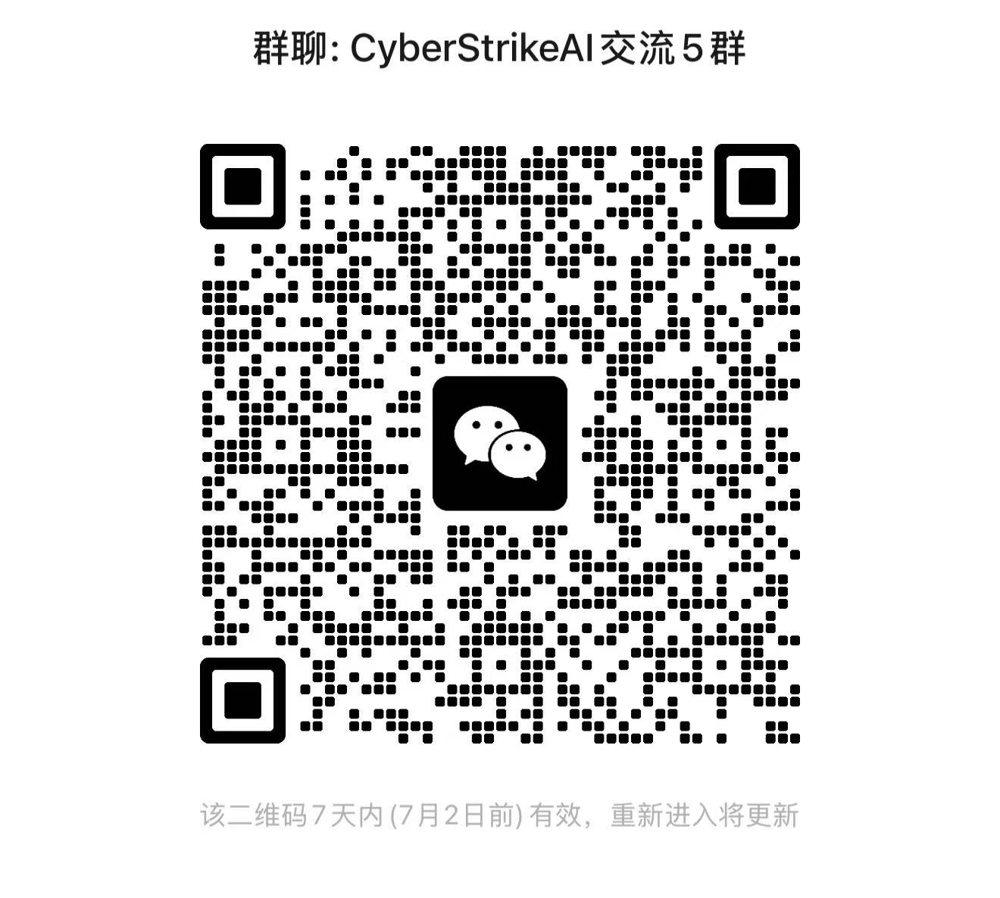
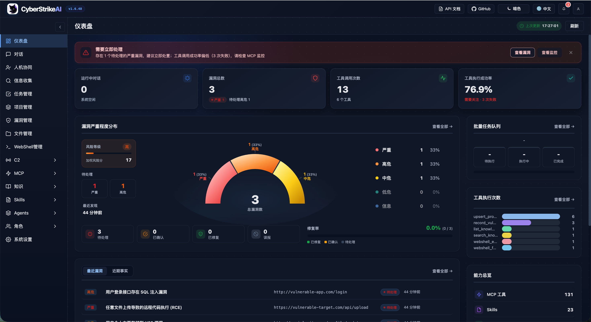

<div align="center">
  
</div>

# CyberStrikeAI


[中文](README_CN.md) | [English](README.md)

**Community**: [Join us on Discord](https://discord.gg/8PjVCMu8Zw)

**CyberStrikeAI is building the agentic execution layer for modern cyber security.**

It brings AI agents, security tools, MCP-native integrations, knowledge systems, human oversight, and attack-chain intelligence into a unified workspace for authorized cyber engagements. Instead of treating tools, prompts, evidence, approvals, and reports as separate fragments, CyberStrikeAI turns security intent into auditable multi-agent workflows that can plan, execute, review, replay, and continuously accumulate operational context.

Built in Go, CyberStrikeAI provides a full-stack foundation for AI-native security operations: 100+ curated tool recipes, role-based testing, Agent Skills, Eino-powered single-agent and multi-agent orchestration, RAG knowledge retrieval, graph workflows, vulnerability and task lifecycle management, WebShell operations, chatbot access, and a lightweight built-in C2 framework for authorized lab and engagement scenarios.

<details>
<summary><strong>WeChat group</strong> (click to reveal QR code)</summary>



</details>

<details>
<summary><strong>Sponsorship</strong> (click to expand)</summary>

If CyberStrikeAI helps you, you can support the project via **WeChat Pay** or **Alipay**:

<div align="center">
  
</div>

</details>

## Interface & Integration Preview

<div align="center">

### System Dashboard Overview

<table>
<tr>
<td width="50%" align="center">
<strong>Light Mode</strong><br/>

</td>
<td width="50%" align="center">
<strong>Dark Mode</strong><br/>

</td>
</tr>
</table>

*The dashboard provides a comprehensive overview of system runtime status, security vulnerabilities, tool usage, and knowledge base, helping users quickly understand the platform's core features and current state.*

### Core Features Overview

<table>
<tr>
<td width="33.33%" align="center">
<strong>Web Console</strong><br/>

</td>
<td width="33.33%" align="center">
<strong>Task Management</strong><br/>

</td>
<td width="33.33%" align="center">
<strong>Vulnerability Management</strong><br/>

</td>
</tr>
<tr>
<td width="33.33%" align="center">
<strong>WebShell Management</strong><br/>

</td>
<td width="33.33%" align="center">
<strong>MCP Management</strong><br/>

</td>
<td width="33.33%" align="center">
<strong>Knowledge Base</strong><br/>

</td>
</tr>
<tr>
<td width="33.33%" align="center">
<strong>Skills Management</strong><br/>

</td>
<td width="33.33%" align="center">
<strong>Agent Management</strong><br/>

</td>
<td width="33.33%" align="center">
<strong>Role Management</strong><br/>

</td>
</tr>
<tr>
<td width="33.33%" align="center">
<strong>System Settings</strong><br/>

</td>
<td width="33.33%" align="center">
<strong>MCP stdio Mode</strong><br/>

</td>
<td width="33.33%" align="center">
<strong>Burp Suite Plugin</strong><br/>

</td>
</tr>
</table>

</div>

## Highlights

- 🤖 Agentic execution layer for translating natural-language intent into precise, governed, auditable security action
- 🧩 Eino-powered single-agent and multi-agent orchestration with Deep, Plan-Execute, and Supervisor modes
- 🔌 MCP-native tool execution with HTTP/stdio/SSE transports, external MCP federation, and dynamic tool discovery
- 🧰 100+ curated security tool recipes, YAML-based extensions, and role-scoped tool control
- 📄 Large-result pagination, compression, and searchable archives
- 🔗 Attack-chain intelligence with graph views, risk scoring, project facts, and step-by-step replay
- 🧑‍⚖️ Human-in-the-loop governance with approval modes, allowlists, audit-agent review, and traceable decisions
- 🔒 Password-protected web UI, audit logs, SQLite persistence, and operational evidence retention
- 📚 Knowledge base (RAG): **Eino MultiQuery** query rewrite + multi-path vector retrieval + **HTTP rerank** (DashScope `gte-rerank` / Cohere-compatible) + post-processing (dedupe, budget); **Eino Compose** indexing pipeline
- 📁 Conversation grouping with pinning, rename, and batch management
- 📂 **Project management**: shared facts (blackboard) across sessions, `upsert_project_fact` + `links` to chain paths; attack-chain and project fact graph views
- 🛡️ Vulnerability management with CRUD operations, severity tracking, status workflow, and statistics
- 📋 Batch task management: create task queues, add multiple tasks, and execute them sequentially
- 🎭 Role-based testing: predefined security testing roles (Penetration Testing, CTF, Web App Scanning, etc.) with custom prompts and tool restrictions
- 🔀 **Graph orchestration**: visual workflow editor (Start / Agent / Tool / Condition / HITL / Output) with `{{previous.output}}` and `{{outputs.variable_name}}` for inter-node data passing; bind a graph to a role for automatic execution on chat. See [Graph orchestration guide](docs/en-US/workflow-graph.md)
- 🧩 **Agent orchestration (CloudWeGo Eino)**: **single-agent** via **`/api/eino-agent/stream`** (Eino ADK `ChatModelAgent`); **multi-agent** via **`/api/multi-agent/stream`** with **`deep`** (coordinator + `task` sub-agents), **`plan_execute`**, or **`supervisor`** (`orchestration` in the request body). ADK **summarization** compresses long contexts; pre-compaction **transcripts** land at `data/conversation_artifacts/<conversation-id>/summarization/transcript.txt` (full user/assistant/tool turns; static system omitted). Markdown under `agents/`: `orchestrator.md`, `orchestrator-plan-execute.md`, `orchestrator-supervisor.md`, plus sub-agent `*.md` (see [Multi-agent doc](docs/en-US/MULTI_AGENT_EINO.md))
- 🖼️ **Vision analysis (`analyze_image`)**: separate VL model (e.g. `qwen-vl-max`) via MCP for local screenshots, captchas, and UI; image bytes stay out of agent history (text summaries only). Configure `vision` in `config.yaml`; see [docs/en-US/VISION.md](docs/en-US/VISION.md)
- 🎯 **Skills (refactored for Eino)**: packs under `skills_dir` follow **Agent Skills** layout (`SKILL.md` + optional files); **multi-agent** sessions use the official Eino ADK **`skill`** tool for **progressive disclosure** (load by name), with optional **host filesystem / shell** via `multi_agent.eino_skills`; optional **`eino_middleware`** adds patchtoolcalls, tool_search, **plantask** (`TaskCreate` / `TaskList` boards under `skills_dir/.eino/plantask/`), reduction, file **checkpoints** (`checkpoint_dir`), ChatModel **retries**, session **output key**, and Deep tuning—20+ sample domains (SQLi, XSS, API security, …) ship under `skills/`
- 📱 **Chatbot**: Personal WeChat, WeCom, DingTalk, Lark, Telegram, Slack, Discord, and QQ Bot—chat from mobile or IM apps (see [Robot / Chatbot guide](docs/en-US/robot.md))
- 🧑‍⚖️ **Human-in-the-loop (HITL)**: Chat sidebar to set approval mode and tool allowlists (listed tools skip approval); global list in `config.yaml` under `hitl.tool_whitelist`; the Audit Agent can use a separate lightweight model via `hitl.audit_model`; **Apply** can merge new tools into the file and update the running server without restart; dedicated **HITL** page for pending approvals. See [HITL best practices](docs/en-US/hitl-best-practices.md)
- 🐚 **WebShell management**: Add and manage WebShell connections (e.g. IceSword/AntSword compatible), use a virtual terminal for command execution, a built-in file manager for file operations, and an AI assistant tab that orchestrates tests and keeps per-connection conversation history; supports PHP, ASP, ASPX, JSP and custom shell types with configurable request method and command parameter.
- 📡 **Built-in C2**: AI-oriented lightweight command-and-control—**listeners** (TCP reverse, HTTP/HTTPS beacon, WebSocket), **encrypted** beacon channel, **session** and **task** queues with persistence, **payload** helpers (one-liner / build / download), **SSE** live events, REST under `/api/c2/*`, plus unified MCP tools (`c2_listener`, `c2_session`, **`c2_task`**, `c2_task_manage`, `c2_payload`, `c2_event`, `c2_profile`, `c2_file`); optional **HITL** approval for sensitive operations and OPSEC-style controls (e.g. command deny rules). **Authorized testing only.**

## Plugins

CyberStrikeAI includes optional integrations under `plugins/`.

- **Burp Suite extension**: `plugins/burp-suite/cyberstrikeai-burp-extension/`  
  Build output: `plugins/burp-suite/cyberstrikeai-burp-extension/dist/cyberstrikeai-burp-extension.jar`  
  Docs: `plugins/burp-suite/cyberstrikeai-burp-extension/README.md`

## Tool Overview

CyberStrikeAI ships with 100+ curated tools covering the whole kill chain:

- **Network Scanners** – nmap, masscan, rustscan, arp-scan, nbtscan
- **Web & App Scanners** – sqlmap, nikto, dirb, gobuster, feroxbuster, ffuf, httpx
- **Vulnerability Scanners** – nuclei, wpscan, wafw00f, dalfox, xsser
- **Subdomain Enumeration** – subfinder, amass, findomain, dnsenum, fierce
- **Network Space Search Engines** – fofa_search, zoomeye_search
- **API Security** – graphql-scanner, arjun, api-fuzzer, api-schema-analyzer
- **Container Security** – trivy, clair, docker-bench-security, kube-bench, kube-hunter
- **Cloud Security** – prowler, scout-suite, cloudmapper, pacu, terrascan, checkov
- **Binary Analysis** – gdb, radare2, ghidra, objdump, strings, binwalk
- **Exploitation** – metasploit, msfvenom, pwntools, ropper, ropgadget
- **Password Cracking** – hashcat, john, hashpump
- **Forensics** – volatility, volatility3, foremost, steghide, exiftool
- **Post-Exploitation** – linpeas, winpeas, mimikatz, bloodhound, impacket, responder
- **CTF Utilities** – stegsolve, zsteg, hash-identifier, fcrackzip, pdfcrack, cyberchef
- **System Helpers** – exec, create-file, delete-file, list-files, modify-file

## Basic Usage

### Quick Start (One-Command Deployment)

**Prerequisites:**
- Go 1.21+ ([Install](https://go.dev/dl/))
- Python 3.10+ ([Install](https://www.python.org/downloads/))

**One-Command Deployment:**
```bash
git clone https://github.com/Ed1s0nZ/CyberStrikeAI.git
cd CyberStrikeAI
chmod +x run.sh && ./run.sh
```

The `run.sh` script will automatically:
- ✅ Check and validate Go & Python environments
- ✅ Create Python virtual environment
- ✅ Install Python dependencies
- ✅ Download Go dependencies
- ✅ Build the project
- ✅ Start the server

**Networking defaults:** `run.sh` starts the server with **`--https`** and the repo **`config.yaml`** (local self-signed TLS; better for many concurrent streams). Use **`./run.sh --http`** for plain HTTP. In production, set **`server.tls_cert_path`** / **`server.tls_key_path`** in **`config.yaml`** (see comments there). For manual runs, add **`--https`** or **`CYBERSTRIKE_HTTPS=1`**; if **`-config`** is wrong, the binary prints a short usage hint on stderr.

**First-Time Configuration:**
1. **Configure OpenAI-compatible API** (required before first use)
   - After launch, open **`https://127.0.0.1:8080/`** (or **`https://localhost:8080/`**; replace **8080** with `server.port` in `config.yaml`) and accept the self-signed certificate warning once. If you used `./run.sh --http`, use **`http://`** instead.
   - Go to `Settings` → Fill in your API credentials:
     ```yaml
     openai:
       api_key: "sk-your-key"
       base_url: "https://api.openai.com/v1"  # or https://api.deepseek.com/v1
       model: "gpt-4o"  # or deepseek-chat, claude-3-opus, etc.
     ```
   - Or edit `config.yaml` directly before launching
2. **Login** - Use the auto-generated password shown in the console (or set `auth.password` in `config.yaml`)
3. **Install security tools (optional)** - Install tools from `tools/` as needed; missing tools are skipped or substituted at runtime. Common examples:

   **macOS (Homebrew):**
   ```bash
   brew install nmap masscan sqlmap nikto gobuster ffuf hydra hashcat nuclei subfinder
   ```

   **Linux (Kali / Debian / Ubuntu):**
   ```bash
   sudo apt update
   sudo apt install -y nmap masscan sqlmap nikto gobuster hydra hashcat john binwalk
   # On some distros, install ffuf/nuclei/subfinder via go install or upstream docs
   ```

   See the `tools/` directory for the full list; refer to each tool's official docs for install details.

**Alternative Launch Methods:**
```bash
# Direct Go run (set up env yourself); add --https to match run.sh defaults
go run cmd/server/main.go --https

# Manual build
go build -o cyberstrike-ai cmd/server/main.go
./cyberstrike-ai --https
```

If server logs show `client sent an HTTP request to an HTTPS server`, a client is still using **`http://`** on a TLS-only port—switch the URL to **`https://`**.

**Note:** The Python virtual environment (`venv/`) is automatically created and managed by `run.sh`. Tools that require Python (like `api-fuzzer`, `http-framework-test`, etc.) will automatically use this environment.

### Version Update (No Breaking Changes)

**CyberStrikeAI one-click upgrade (recommended):**
1. (First time) enable the script: `chmod +x upgrade.sh`
2. Upgrade with: `./upgrade.sh` (optional flags: `--tag vX.Y.Z`, `--no-venv`, `--yes`). Local `tools/`, `roles/`, and `skills/` are always preserved.
3. The script will back up your `config.yaml` and `data/`, upgrade the code from GitHub Release, update `config.yaml`'s `version`, then restart the server.

Recommended one-liner:
`chmod +x upgrade.sh && ./upgrade.sh --yes`

If something goes wrong, you can restore from `.upgrade-backup/` (or manually copy `/data` and `config.yaml` back) and run `./run.sh` again.

Requirements / tips:
* You need `curl` or `wget` for downloading Release packages.
* `rsync` is recommended/required for the safe code sync.
* If GitHub API rate-limits you, set `export GITHUB_TOKEN="..."` before running `./upgrade.sh`.

⚠️ **Note:** This procedure only applies to version updates without compatibility or breaking changes. If a release includes compatibility changes, this method may not apply.

**Examples:** No breaking changes — e.g. v1.3.1 → v1.3.2; with breaking changes — e.g. v1.3.1 → v1.4.0. The project follows [Semantic Versioning](https://semver.org/) (SemVer): when only the patch version (third number) changes, this upgrade path is usually safe; when the minor or major version changes, config, data, or APIs may have changed — check the release notes before using this method.

### Core Workflows
- **Conversation testing** – Natural-language prompts trigger toolchains with streaming SSE output.
- **Single vs multi-agent** – Chat UI switches between **Eino single-agent** (`/api/eino-agent/stream`) and **multi-agent** (`/api/multi-agent/stream` with `orchestration`: `deep` | `plan_execute` | `supervisor`). Multi mode requires `multi_agent.enabled: true`. MCP tools are bridged the same way for both paths.
- **Role-based testing** – Select from predefined security testing roles (Penetration Testing, CTF, Web App Scanning, API Security Testing, etc.) to customize AI behavior and tool availability. Each role applies custom system prompts and can restrict available tools for focused testing scenarios.
- **Graph orchestration** – Design flows on the **Graph Orchestration** page (drag nodes, connect edges, save); bind `workflow_id` on a role to run the graph on chat (Agent, MCP tools, condition branches). Use `{{outputs.variable_name}}` to pass data across non-adjacent nodes. See [Graph orchestration guide](docs/en-US/workflow-graph.md).
- **Tool monitor** – Inspect running jobs, execution logs, and large-result attachments.
- **History & audit** – Every conversation and tool invocation is stored in SQLite with replay.
- **Conversation groups** – Organize conversations into groups, pin important groups, rename or delete groups via context menu.
- **Vulnerability management** – Create, update, and track vulnerabilities discovered during testing. Filter by severity (critical/high/medium/low/info), status (open/confirmed/fixed/false_positive), and conversation. View statistics and export findings.
- **Batch task management** – Create task queues with multiple tasks, add or edit tasks before execution, and run them sequentially. Each task executes as a separate conversation, with status tracking (pending/running/completed/failed/cancelled) and full execution history.
- **WebShell management** – Add and manage WebShell connections (PHP/ASP/ASPX/JSP or custom). Use the virtual terminal to run commands, the file manager to list, read, edit, upload, and delete files, and the AI assistant tab to drive scripted tests with per-connection conversation history. Connections are stored in SQLite; supports GET/POST and configurable command parameter (e.g. IceSword/AntSword style).
- **Built-in C2** – Create/start **listeners**, generate **payloads**, track **sessions**, enqueue **tasks**, and subscribe to **events** (SSE) from the Web UI or `/api/c2/*`. Agents and external clients use the C2 MCP tool family (including **`c2_task`**); when HITL is enabled, high-risk tasks can require human approval. Intended **only** for systems you are explicitly authorized to test.
- **Settings** – Tweak provider keys, MCP enablement, tool toggles, and agent iteration limits.
- **Human-in-the-loop (HITL)** – Sidebar sets mode and allowlisted tools (comma- or newline-separated); global list lives in `config.yaml` under `hitl.tool_whitelist`. The Audit Agent can use a separate low-cost model through `hitl.audit_model`, useful when human reviewers cannot keep up. **Apply** updates browser/server and can merge new tools into the file (**no restart**). **New chat** keeps sidebar choices; **HITL** nav shows pending approvals. Removing a tool in the sidebar does not remove it from the global list in `config.yaml`—edit the file if needed.

### Built-in Safeguards
- Required-field validation prevents accidental blank API credentials.
- Auto-generated strong passwords when `auth.password` is empty.
- Unified auth middleware for every web/API call (Bearer token flow).
- Timeout and sandbox guards per tool, plus structured logging for triage.

## Advanced Usage

### Role-Based Testing
- **Predefined roles** – System includes 12+ predefined security testing roles (Penetration Testing, CTF, Web App Scanning, API Security Testing, Binary Analysis, Cloud Security Audit, etc.) in the `roles/` directory.
- **Custom prompts** – Each role can define a `user_prompt` that prepends to user messages, guiding the AI to adopt specialized testing methodologies and focus areas.
- **Tool restrictions** – Roles can specify a `tools` list to limit available tools, ensuring focused testing workflows (e.g., CTF role restricts to CTF-specific utilities).
- **Skills** – Skill packs live under `skills_dir` and load via the Eino ADK **`skill`** tool (**progressive disclosure**) in both **single- and multi-agent** sessions when **`multi_agent.eino_skills`** is enabled. Optional host **read_file / glob / grep / write / edit / execute** and **`eino_middleware`** (tool_search, plantask, reduction, checkpoints, summarization transcripts, etc.) apply per mode—see docs.
- **Easy role creation** – Create custom roles by adding YAML files to the `roles/` directory. Each role defines `name`, `description`, `user_prompt`, `icon`, `tools`, and `enabled` fields.
- **Web UI integration** – Select roles from a dropdown in the chat interface. Role selection affects both AI behavior and available tool suggestions.

**Creating a custom role (example):**
1. Create a YAML file in `roles/` (e.g., `roles/custom-role.yaml`):
   ```yaml
   name: Custom Role
   description: Specialized testing scenario
   user_prompt: You are a specialized security tester focusing on API security...
   icon: "\U0001F4E1"
   tools:
     - api-fuzzer
     - arjun
     - graphql-scanner
   enabled: true
   ```
2. Restart the server or reload configuration; the role appears in the role selector dropdown.

### Multi-Agent Mode (Eino: Deep, Plan-Execute, Supervisor)
- **What it is** – Multi-agent orchestration on CloudWeGo **Eino** `adk/prebuilt` (alongside **Eino single-agent** on `/api/eino-agent*`): **`deep`** — coordinator + **`task`** sub-agents for complex security testing and delegated synthesis; **`plan_execute`** — planner / executor / replanner for structured loops; **`supervisor`** — expert-routing mode with **`transfer`** / **`exit`** for multiple specialist sub-agents. Client sends **`orchestration`**: `deep` | `plan_execute` | `supervisor` (default `deep`).
- **Markdown agents** – Under `agents_dir` (default `agents/`):
  - **Deep orchestrator**: `orchestrator.md` *or* one `.md` with `kind: orchestrator`. Body or `multi_agent.orchestrator_instruction`, then Eino defaults.
  - **Plan-Execute orchestrator**: fixed name **`orchestrator-plan-execute.md`** (plus optional `orchestrator_instruction_plan_execute` in YAML).
  - **Supervisor orchestrator**: fixed name **`orchestrator-supervisor.md`** (plus optional `orchestrator_instruction_supervisor`); requires at least one sub-agent, and one-sub-agent runs emit a hint that expert routing has limited value.
  - **Sub-agents** (for **deep** / **supervisor**): other `*.md` files (YAML front matter + body). Not used as **`task`** targets if marked orchestrator-only.
- **Management** – Web UI: **Agents → Agent management**; API `/api/multi-agent/markdown-agents`.
- **Config** – `multi_agent` in `config.yaml`: `enabled`, `robot_default_agent_mode`, `batch_use_multi_agent`, `max_iteration`, `plan_execute_loop_max_iterations`, per-mode orchestrator instruction fields, optional YAML `sub_agents` merged with disk (`id` clash → Markdown wins), **`eino_skills`**, **`eino_middleware`** (optional ADK middleware and Deep/Supervisor tuning).
- **Resilience & long runs** – `checkpoint_dir` enables ADK **resume** after process crashes (distinct from trace-based “interrupt & continue”). `deep_model_retry_max_retries` retries transient LLM API failures within a single call. **Summarization** writes a filtered **transcript** when compression fires; the summary message includes the path so the model can `read_file` for scan output and other pre-compaction details.
- **Details** – **[docs/en-US/MULTI_AGENT_EINO.md](docs/en-US/MULTI_AGENT_EINO.md)** (streaming, robots, batch, middleware caveats).

### Skills System (Agent Skills + Eino)
- **Layout** – Each skill is a directory with **required** `SKILL.md` only ([Agent Skills](https://platform.claude.com/docs/en/agents-and-tools/agent-skills/overview)): YAML front matter **only** `name` and `description`, plus Markdown body. Optional sibling files (`FORMS.md`, `REFERENCE.md`, `scripts/*`, …). **No** `SKILL.yaml` (not part of Claude or Eino specs); sections/scripts/progressive behavior are **derived at runtime** from Markdown and the filesystem.
- **Runtime refactor** – **`skills_dir`** is the single root for packs. **Multi-agent** loads them through Eino’s official **`skill`** middleware (**progressive disclosure**: model calls `skill` with a pack **name** instead of receiving full SKILL text up front). Configure via **`multi_agent.eino_skills`**: `disable`, `filesystem_tools` (host read/glob/grep/write/edit/execute), `skill_tool_name`.
- **Eino / RAG** – Packages are also split into `schema.Document` chunks for `FilesystemSkillsRetriever` (`skills.AsEinoRetriever()`) in **compose** graphs (e.g. knowledge/indexing pipelines).
- **HTTP API** – `/api/skills` listing and `depth` (`summary` | `full`), `section`, and `resource_path` remain for the web UI and ops; **model-side** skill loading in multi-agent uses the **`skill`** tool, not MCP.
- **Optional `eino_middleware`** – e.g. `tool_search` (dynamic MCP tool list), `patch_tool_calls`, **`plantask`** (Eino `TaskCreate` / `TaskGet` / `TaskUpdate` / `TaskList`; JSON under `skills_dir/.eino/plantask/<conversation-id>/`; Eino clears task files when **all** tasks are marked completed), `reduction`, **`checkpoint_dir`** (`data/eino-checkpoints/`), **`deep_model_retry_max_retries`**, **`deep_output_key`**, task-tool description prefix—see `config.yaml` and `internal/config/config.go`.
- **Shipped demo** – `skills/cyberstrike-eino-demo/`; see `skills/README.md`.

**Creating a skill:**
1. `mkdir skills/<skill-id>` and add standard `SKILL.md` (+ any optional files), or drop in an open-source skill folder as-is.
2. Use **multi-agent** with **`multi_agent.eino_skills`** enabled so the model can call the **`skill`** tool with that pack **name**.

### Tool Orchestration & Extensions
- **YAML recipes** in `tools/*.yaml` describe commands, arguments, prompts, and metadata.
- **Directory hot-reload** – pointing `security.tools_dir` to a folder is usually enough; inline definitions in `config.yaml` remain supported for quick experiments.
- **Large tool outputs** – outputs beyond `reduction_max_length_for_trunc` are summarized via Eino reduction with full content persisted under `tmp/reduction/`; use `read_file` on the path in `<persisted-output>`.
- **Result compression** – multi-megabyte logs can be summarized or losslessly compressed before persisting to keep SQLite lean.

**Creating a custom tool (typical flow)**
1. Copy an existing YAML file from `tools/` (for example `tools/nmap.yaml` or `tools/ffuf.yaml`).
2. Update `name`, `command`, `args`, and `short_description`.
3. Describe positional or flag parameters in `parameters[]` so the agent knows how to build CLI arguments.
4. Provide a longer `description`/`notes` block if the agent needs extra context or post-processing tips.
5. Restart the server or reload configuration; the new tool becomes available immediately and can be enabled/disabled from the Settings panel.

### Attack-Chain Intelligence
- AI parses each conversation to assemble targets, tools, vulnerabilities, and relationships.
- The web UI renders the chain as an interactive graph with severity scoring and step replay.
- Export the chain or raw findings to external reporting pipelines.

### WebShell Management
- **Connections** – From the Web UI, go to **WebShell Management** to add, edit, or delete WebShell connections. Each connection stores: Shell URL, password/key, shell type (PHP, ASP, ASPX, JSP, Custom), request method (GET/POST), command parameter name (default `cmd`), and an optional remark; all records persist in SQLite and are compatible with common clients such as IceSword and AntSword.
- **Virtual terminal** – After selecting a connection, use the **Virtual terminal** tab to run arbitrary commands with history and quick commands (whoami/id/ls/pwd etc.). Output is streamed in the browser, and Ctrl+L clears the screen.
- **File manager** – Use the **File manager** tab to list directories, read or edit files, delete files, create folders/files, upload files (including chunked uploads for large files), rename paths, and download selected files. Path navigation supports breadcrumbs, parent directory jumps, and name filtering.
- **AI assistant** – Use the **AI assistant** tab to chat with an agent that understands the current WebShell connection, automatically runs tools and shell commands, and maintains per-connection conversation history with a sidebar of previous sessions.
- **Connectivity test** – Use **Test connectivity** to verify that the shell URL, password, and command parameter are correct before running commands (sends a lightweight `echo 1` check).
- **Persistence** – All WebShell connections and AI conversations are stored in SQLite (same database as conversations), so they persist across restarts.

### Built-in C2 (Command & Control)
- **What it is** – A first-party, **AI-native** C2 stack: listeners accept implants (beacons), the server stores **sessions** and **tasks** in SQLite, pushes updates over an **event bus** (including **SSE**), and exposes everything through authenticated **REST** plus MCP.
- **Listeners & transports** – `tcp_reverse`, `http_beacon`, `https_beacon`, and `websocket`; per-listener crypto keys; running listeners can be **restored after restart** when marked running in the database.
- **Agent integration** – MCP exposes a small **C2 tool family** (listeners, sessions, **`c2_task`**, task management, payloads, events, profiles, files) so the same agent loop can orchestrate C2 alongside other tools; dangerous task types can go through the existing **HITL** bridge when your session policy requires it.
- **Safety** – Use **only** in lab or **fully authorized** engagements; combine network isolation, strong auth, and HITL/allowlists as your policy demands.

### MCP Everywhere
- **Web mode** – ships with HTTP MCP server automatically consumed by the UI.
- **MCP stdio mode** – `go run cmd/mcp-stdio/main.go` exposes the agent to Cursor/CLI.
- **External MCP federation** – register third-party MCP servers (HTTP, stdio, or SSE) from the UI, toggle them per engagement, and monitor their health and call volume in real time.
- **Optional MCP servers** – the [`mcp-servers/`](mcp-servers/README.md) directory provides standalone MCPs (e.g. reverse shell). They speak standard MCP over stdio and work with CyberStrikeAI (Settings → External MCP), Cursor, VS Code, and other MCP clients.

#### MCP stdio quick start
1. **Build the binary** (run from the project root):
   ```bash
   go build -o cyberstrike-ai-mcp cmd/mcp-stdio/main.go
   ```
2. **Wire it up in Cursor**  
   Open `Settings → Tools & MCP → Add Custom MCP`, pick **Command**, then point to the compiled binary and your config:
   ```json
   {
     "mcpServers": {
       "cyberstrike-ai": {
         "command": "/absolute/path/to/cyberstrike-ai-mcp",
         "args": [
           "--config",
           "/absolute/path/to/config.yaml"
         ]
       }
     }
   }
   ```
   Replace the paths with your local locations; Cursor will launch the stdio server automatically.

#### MCP HTTP quick start (Cursor / Claude Code)
The HTTP MCP server runs on a separate port (default `8081`) and supports **header-based authentication** so only clients that send the correct header can call tools.

1. **Enable MCP in config** – In `config.yaml` set `mcp.enabled: true` and optionally `mcp.host` / `mcp.port`. For auth (recommended if the port is reachable from the network), set:
   - `mcp.auth_header` – header name (e.g. `X-MCP-Token`);
   - `mcp.auth_header_value` – secret value. **Leave it empty** if you want the server to **auto-generate** a random token on first start and write it back to the config.
2. **Start the service** – Run `./run.sh` or `go run cmd/server/main.go`. The MCP endpoint is `http://<host>:<port>/mcp` (e.g. `http://localhost:8081/mcp`).
3. **Copy the JSON from the terminal** – When MCP is enabled, the server prints a **ready-to-paste** JSON block. If `auth_header_value` was empty, it will have been generated and saved; the printed JSON includes the URL and headers.
4. **Use in Cursor or Claude Code**:
   - **Cursor**: Paste the block into `~/.cursor/mcp.json` (or your project’s `.cursor/mcp.json`) under `mcpServers`, or merge it into your existing `mcpServers`.
   - **Claude Code**: Paste into `.mcp.json` or `~/.claude.json` under `mcpServers`.

Example of what the terminal prints (with auth enabled):
```json
{
  "mcpServers": {
    "cyberstrike-ai": {
      "url": "http://localhost:8081/mcp",
      "headers": {
        "X-MCP-Token": "<auto-generated-or-your-value>"
      },
      "type": "http"
    }
  }
}
```
If you do not set `auth_header` / `auth_header_value`, the endpoint accepts requests without authentication (suitable only for localhost or trusted networks).

#### External MCP federation (HTTP/stdio/SSE)
CyberStrikeAI supports connecting to external MCP servers via three transport modes:
- **HTTP mode** – traditional request/response over HTTP POST
- **stdio mode** – process-based communication via standard input/output
- **SSE mode** – Server-Sent Events for real-time streaming communication

To add an external MCP server:
1. Open the Web UI and navigate to **Settings → External MCP**.
2. Click **Add External MCP** and provide the configuration in JSON format:

   **HTTP mode example:**
   ```json
   {
     "my-http-mcp": {
       "transport": "http",
       "url": "http://127.0.0.1:8081/mcp",
       "description": "HTTP MCP server",
       "timeout": 30
     }
   }
   ```

   **stdio mode example:**
   ```json
   {
     "my-stdio-mcp": {
       "command": "python3",
       "args": ["/path/to/mcp-server.py"],
       "description": "stdio MCP server",
       "timeout": 30
     }
   }
   ```

   **SSE mode example:**
   ```json
   {
     "my-sse-mcp": {
       "transport": "sse",
       "url": "http://127.0.0.1:8082/sse",
       "description": "SSE MCP server",
       "timeout": 30
     }
   }
   ```

3. Click **Save** and then **Start** to connect to the server.
4. Monitor the connection status, tool count, and health in real time.

**SSE mode benefits:**
- Real-time bidirectional communication via Server-Sent Events
- Suitable for scenarios requiring continuous data streaming
- Lower latency for push-based notifications

A test SSE MCP server is available at `cmd/test-sse-mcp-server/` for validation purposes.

### Knowledge Base
- **Vector search** – AI agent can automatically search the knowledge base for relevant security knowledge during conversations using the `search_knowledge_base` tool.
- **RAG pipeline (always on)** – **MultiQuery** (LLM query rewrite) → vector prefetch & fusion → **HTTP rerank** (DashScope `gte-rerank` or Cohere-compatible `/v1/rerank`) → post-processing (normalized dedupe, char/token budget, final top_k). Rerank failures degrade to fusion order without breaking search.
- **Vector retrieval** – cosine similarity over stored embeddings with configurable threshold, aligned with Eino `retriever.Retriever` usage.
- **Auto-indexing** – scans the `knowledge_base/` directory for Markdown files and automatically indexes them with embeddings (Markdown header split + recursive chunking via Eino).
- **Web management** – create, update, delete knowledge items through the web UI, with category-based organization; settings page exposes MultiQuery / rerank / prefetch options.
- **Retrieval logs** – tracks all knowledge retrieval operations for audit and debugging.

**Setting up the knowledge base:**
1. **Enable in config** – set `knowledge.enabled: true` in `config.yaml`:
   ```yaml
   knowledge:
     enabled: true
     base_path: knowledge_base
     embedding:
       provider: openai
       model: text-embedding-v4
       base_url: "https://api.openai.com/v1"  # or your embedding API
       api_key: "sk-xxx"
     retrieval:
       top_k: 5
       similarity_threshold: 0.7
       multi_query:
         max_queries: 4        # LLM rewrite variants (always on)
       rerank:                 # always on; empty fields inherit openai/embedding credentials
         provider: ""          # auto: dashscope | cohere from base_url
         model: ""             # empty: gte-rerank (DashScope) or rerank-multilingual-v3.0 (Cohere)
         base_url: ""
         api_key: ""
       post_retrieve:
         prefetch_top_k: 20    # vector candidates per MultiQuery variant; 0 = max(top_k×4, 20)
         max_context_chars: 0
         max_context_tokens: 0
   ```
2. **Add knowledge files** – place Markdown files in `knowledge_base/` directory, organized by category (e.g., `knowledge_base/SQL Injection/README.md`).
3. **Scan and index** – use the web UI to scan the knowledge base directory, which will automatically import files and build vector embeddings.
4. **Use in conversations** – the AI agent will automatically use `search_knowledge_base` when it needs security knowledge. You can also explicitly ask: "Search the knowledge base for SQL injection techniques".

**Knowledge base structure:**
- Files are organized by category (directory name becomes the category).
- Each Markdown file becomes a knowledge item with automatic chunking for vector search.
- The system supports incremental updates – modified files are re-indexed automatically.


### Automation Hooks
- **REST APIs** – everything the UI uses (auth, conversations, tool runs, monitor, vulnerabilities, roles) is available over JSON.
- **Multi-agent APIs** – `POST /api/multi-agent/stream` (SSE, when enabled), `POST /api/multi-agent` (non-streaming), Markdown agents under `/api/multi-agent/markdown-agents` (list/get/create/update/delete).
- **Role APIs** – manage security testing roles via `/api/roles` endpoints: `GET /api/roles` (list all roles), `GET /api/roles/:name` (get role), `POST /api/roles` (create role), `PUT /api/roles/:name` (update role), `DELETE /api/roles/:name` (delete role). Roles are stored as YAML files in the `roles/` directory and support hot-reload.
- **Vulnerability APIs** – manage vulnerabilities via `/api/vulnerabilities` endpoints: `GET /api/vulnerabilities` (list with filters), `POST /api/vulnerabilities` (create), `GET /api/vulnerabilities/:id` (get), `PUT /api/vulnerabilities/:id` (update), `DELETE /api/vulnerabilities/:id` (delete), `GET /api/vulnerabilities/stats` (statistics).
- **Batch Task APIs** – manage batch task queues via `/api/batch-tasks` endpoints: `POST /api/batch-tasks` (create queue), `GET /api/batch-tasks` (list queues), `GET /api/batch-tasks/:queueId` (get queue), `POST /api/batch-tasks/:queueId/start` (start execution), `POST /api/batch-tasks/:queueId/cancel` (cancel), `DELETE /api/batch-tasks/:queueId` (delete), `POST /api/batch-tasks/:queueId/tasks` (add task), `PUT /api/batch-tasks/:queueId/tasks/:taskId` (update task), `DELETE /api/batch-tasks/:queueId/tasks/:taskId` (delete task). Tasks execute sequentially, each creating a separate conversation with full status tracking.
- **WebShell APIs** – manage WebShell connections and execute commands via `/api/webshell/connections` (GET list, POST create, PUT update, DELETE delete) and `/api/webshell/exec` (command execution), `/api/webshell/fileop` (list/read/write/delete files).
- **C2 APIs** – manage listeners, sessions, tasks, payloads, files, and events under `/api/c2/*` (e.g. listeners CRUD/start/stop, session sleep, task create/cancel/wait, payload build/download, event stream).
- **Task control** – pause/resume/stop long scans, re-run steps with new params, or stream transcripts.
- **Audit & security** – rotate passwords via `/api/auth/change-password`, enforce short-lived sessions, and restrict MCP ports at the network layer when exposing the service.

## Configuration Reference

```yaml
auth:
  password: "change-me"
  session_duration_hours: 12
server:
  host: "0.0.0.0"
  port: 8080
log:
  level: "info"
  output: "stdout"
mcp:
  enabled: true
  host: "0.0.0.0"
  port: 8081
  auth_header: "X-MCP-Token"       # optional; leave empty for no auth
  auth_header_value: ""            # optional; leave empty to auto-generate on first start
openai:
  api_key: "sk-xxx"
  base_url: "https://api.deepseek.com/v1"
  model: "deepseek-chat"
database:
  path: "data/conversations.db"
  knowledge_db_path: "data/knowledge.db"  # Optional: separate DB for knowledge base
security:
  tools_dir: "tools"
knowledge:
  enabled: false  # Enable knowledge base feature
  base_path: "knowledge_base"  # Path to knowledge base directory
  embedding:
    provider: "openai"  # Embedding provider (currently only "openai")
    model: "text-embedding-v4"  # Embedding model name
    base_url: ""  # Leave empty to use OpenAI base_url
    api_key: ""  # Leave empty to use OpenAI api_key
  retrieval:
    top_k: 5  # Number of top results to return
    similarity_threshold: 0.7  # Minimum cosine similarity (0-1)
    multi_query:
      max_queries: 4  # MultiQuery rewrite variants (always on)
    rerank:  # HTTP rerank (always on); empty fields inherit openai/embedding credentials
      provider: ""
      model: ""
      base_url: ""
      api_key: ""
    post_retrieve:
      prefetch_top_k: 20  # per MultiQuery variant; 0 = max(top_k×4, 20)
      max_context_chars: 0
      max_context_tokens: 0
roles_dir: "roles"  # Role configuration directory (relative to config file)
skills_dir: "skills"  # Skills directory (relative to config file)
agents_dir: "agents"  # Multi-agent Markdown definitions (orchestrator + sub-agents)
multi_agent:
  enabled: false
  default_mode: "eino_single"   # eino_single | multi (UI default when multi-agent is enabled)
  robot_default_agent_mode: eino_single
  batch_use_multi_agent: false
  orchestrator_instruction: ""  # Deep; used when orchestrator.md body is empty
  # orchestrator_instruction_plan_execute / orchestrator_instruction_supervisor optional
  # eino_skills: { disable: false, filesystem_tools: true, skill_tool_name: skill }
  # eino_middleware: plantask_enable, checkpoint_dir, deep_model_retry_max_retries, deep_output_key, ...
project:
  enabled: true              # Enable project blackboard & fact MCP tools
  fact_index_max_runes: 65000
  fact_summary_max_runes: 24000
  default_inject_deprecated: false
```

### Tool Definition Example (`tools/nmap.yaml`)

```yaml
name: "nmap"
command: "nmap"
args: ["-sT", "-sV", "-sC"]
enabled: true
short_description: "Network mapping & service fingerprinting"
parameters:
  - name: "target"
    type: "string"
    description: "IP or domain"
    required: true
    position: 0
  - name: "ports"
    type: "string"
    flag: "-p"
    description: "Range, e.g. 1-1000"
```

### Role Definition Example (`roles/penetration-testing.yaml`)

```yaml
name: Penetration Testing
description: Professional penetration testing expert for comprehensive security testing
user_prompt: You are a professional cybersecurity penetration testing expert. Please use professional penetration testing methods and tools to conduct comprehensive security testing on targets, including but not limited to SQL injection, XSS, CSRF, file inclusion, command execution and other common vulnerabilities.
icon: "\U0001F3AF"
tools:
  - nmap
  - sqlmap
  - nuclei
  - burpsuite
  - metasploit
  - httpx
  - record_vulnerability
  - list_knowledge_risk_types
  - search_knowledge_base
enabled: true
```

## Related documentation

- [Documentation index](docs/README.md): deployment, configuration, security model, API, knowledge base, C2, WebShell, MCP, development, testing, and troubleshooting.
- [Deployment guide](docs/en-US/deployment.md): source/binary startup, HTTPS, reverse proxy, systemd, backup, upgrade, and rollback.
- [Runbooks](docs/en-US/runbooks.md): production setup, external MCP, knowledge base, authorized Web testing, and C2 cleanup workflows.
- [Security hardening](docs/en-US/security-hardening.md): launch baseline, HITL allowlist, reverse proxy, file permissions, and periodic review.
- [API recipes](docs/en-US/api-recipes.md): examples for login, Agent, streaming, multi-agent, uploads, vulnerabilities, KB, and audit export.
- [Configuration reference](docs/en-US/configuration.md): main `config.yaml` sections, recommended values, and update guidance.
- [Security model](docs/en-US/security-model.md): authentication, tool execution, HITL, audit, C2/WebShell, and data safety boundaries.
- [API reference](docs/en-US/api-reference.md): OpenAPI, authentication, Agent, projects, knowledge base, C2, WebShell, and other API entry points.
- [Multi-agent mode (Eino)](docs/en-US/MULTI_AGENT_EINO.md): **Deep**, **Plan-Execute**, **Supervisor**, `agents/*.md`, `eino_skills` / `eino_middleware`, APIs, and chat/stream behavior.
- [Graph orchestration guide](docs/en-US/workflow-graph.md): visual workflow design, node configuration, `previous` / `outputs` variable passing, and role binding.
- [Robot / Chatbot guide](docs/en-US/robot.md): Setup, commands, and troubleshooting for WeChat, WeCom, DingTalk, Lark, Telegram, Slack, Discord, and QQ Bot.
- [HITL best practices](docs/en-US/hitl-best-practices.md): reviewer modes, allowlists, Audit Agent prompts, and separate small-model configuration.

## Project Layout

```
CyberStrikeAI/
├── cmd/                 # Server, MCP stdio entrypoints, tooling
├── internal/            # Agent, MCP core, handlers, C2 (`internal/c2`), security executor
├── web/                 # Static SPA + templates
├── tools/               # YAML tool recipes (100+ examples provided)
├── roles/               # Role configurations (12+ predefined security testing roles)
├── skills/              # Agent Skills dirs (SKILL.md + optional files; demo: cyberstrike-eino-demo)
├── agents/              # Multi-agent Markdown (orchestrator.md + sub-agent *.md)
├── docs/                # Topic docs (deployment, config, security, API, knowledge base, C2, WebShell, etc.)
├── images/              # Docs screenshots & diagrams
├── config.yaml          # Runtime configuration
├── run.sh               # Convenience launcher
└── README*.md
```

## Basic Usage Examples

```
Scan open ports on 192.168.1.1
Perform a comprehensive port scan on 192.168.1.1 focusing on 80,443,22
Check if https://example.com/page?id=1 is vulnerable to SQL injection
Scan https://example.com for hidden directories and outdated software
Enumerate subdomains for example.com, then run nuclei against the results
```

## Advanced Playbooks

```
Load the recon-engagement template, run amass/subfinder, then brute-force dirs on every live host.
Use external Burp-based MCP server for authenticated traffic replay, then pass findings back for graphing.
Compress the 5 MB nuclei report, summarize critical CVEs, and attach the artifact to the conversation.
Build an attack chain for the latest engagement and export the node list with severity >= high.
```

## 404Starlink 


CyberStrikeAI has joined [404Starlink](https://github.com/knownsec/404StarLink)

## TCH Top-Ranked Intelligent Pentest Project  
<div align="left">
  <a href="https://zc.tencent.com/competition/competitionHackathon?code=cha004" target="_blank">
    
  </a>
</div>


---

## License

CyberStrikeAI is licensed under the Apache License 2.0.  
See the [LICENSE](LICENSE) file for details.

---

## ⚠️ Disclaimer

**This tool is for educational and authorized testing purposes only!**

CyberStrikeAI is a professional security testing platform designed to assist security researchers, penetration testers, and IT professionals in conducting security assessments and vulnerability research **with explicit authorization**.

**By using this tool, you agree to:**
- Use this tool only on systems where you have clear written authorization
- Comply with all applicable laws, regulations, and ethical standards
- Take full responsibility for any unauthorized use or misuse
- Not use this tool for any illegal or malicious purposes

**The developers are not responsible for any misuse!** Please ensure your usage complies with local laws and regulations, and that you have obtained explicit authorization from the target system owner.

For vulnerability reporting and deployment hardening guidance, see [SECURITY.md](SECURITY.md).

---

Need help or want to contribute? Open an issue or PR—community tooling additions are welcome!
